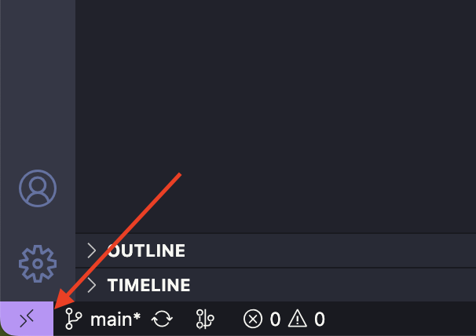
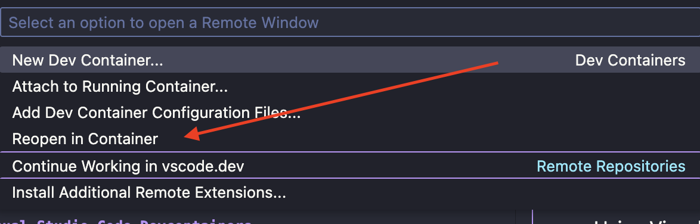

# Translation API Play

Playground to explore Googles translation API [Translation AI](https://cloud.google.com/translate)

## Creating API keys

### In a Visual Studio Code Dev containers

1. If not already in a dev container follow this guide [Running the app in a Visual Studio Code Dev containers](#using-visual-studio-code-dev-containers)

2. If not already logged in to gcloud, run the following in the integrated terminal:

```shell
just initialize-gcloud
```

3. To create a API key run the following in the integrated terminal:

```shell
just create-api-key-dev <GCP PROJECT_ID> <UNIQUENESS SUFFIX>
```

4. Add the API key to a `.env` file

```env
TRANSLATE_API_KEY=<CREATED API KEY>
```

## Running the app

### Using Visual Studio Code Dev containers

1. Install this extension [Dev Containers](https://marketplace.visualstudio.com/items?itemName=ms-vscode-remote.remote-containers)

2. Click on the left bottom button to open the dev container menu



3. Select `Reopen in Conatiner`.



4. Once in the dev container run the following in the integrated terminal:

```shell
just run-dev
```
